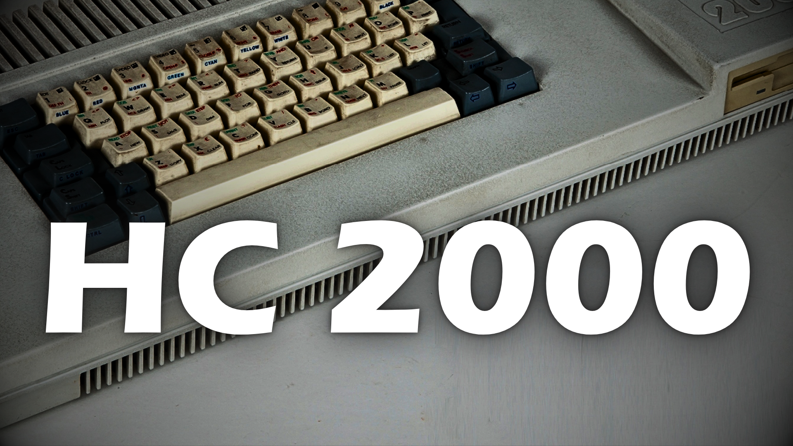

# Cătălin Ilinca

> Engineer by trade. Tryhard creator by night. Slop hater always.

```
$ whoami
cătălin "gmrdad82" ilinca
> engineer            // still shipping
> youtube creator     // gaming, life, and everything in between
> based in            // spain (since 2022)
> ai stance           // embracer, not evangelist
> slop tolerance      // 0.00
```

---

## How it started

<a href="https://youtu.be/LPmitiK-oHI">
  
</a>

`▶ My First Computer — how it all started.`

---

## How I got here

```
$ git log --oneline --decorate --graph
* a4f7b2c (HEAD -> now) engineering, youtubing, gaming, still building, slop-free
* 8e3d910 (tag: toptal-2024)       wrapped 2 years — senior se, refactored monoliths
* 2c1f48a (tag: spain-2022)        relocated to castellón, kept shipping
* 6b9a503 (tag: thoughtworks-2022) closed out 4 years — aircall, swrve, s4m
* d5e7c2f (tag: fepra-2018)        architected fepra.ro — still running flawlessly
* 9fa3b71 (tag: 2performant-2015)  joined as tech lead — devops, mentoring, microservices
* 4ce61d8 (tag: 2parale-2013)      lead dev at 2parale (which became 2performant)
* 1afebbe (tag: v1.0-2006)         shipped my first paid code as a freelancer
```

---

## Right now

```
$ git status
On branch life
Your branch is ahead of 'main' by ∞ commits.

Active worktrees (parallel branches):
  ../2performant   devops
  ../fepra         engineer
  ../youtube       creator (gmrdad82)

Changes not staged for commit:
  modified:   sleep.lock
  modified:   gaming.session
  new file:   tools/various.rb
  helper:     claude — as another pair of hands

(use "git commit" if you ever stop)
```

---

## Channels

```
$ cat ~/.channels
youtube  @gmrdad82  https://youtube.com/@gmrdad82
# more channels coming soon
```

---

## Stack & Gear

```
$ tree ~/setup
.
├── daily/
│   ├── omarchy           # linux, btw
│   ├── neovim
│   ├── kitty             # terminal
│   ├── ruby on rails
│   ├── claude            # ai, as another pair of hands
│   ├── slack
│   ├── brave
│   └── obs               # recording / streaming
├── studio/
│   ├── sony zv-e10 + sigma 17-40mm f/1.8 dc art
│   ├── rode podmic (xlr) → focusrite scarlett solo 4th gen
│   └── ugreen capture card
├── gaming/
│   ├── ps5 pro
│   ├── nintendo switch 2
│   ├── sony dualsense edge ×2  (black & white)
│   └── nintendo switch pro controller
└── desk/
    ├── asus rog zephyrus m16 (2023)
    ├── asus rog 27" woled (4th-gen tandem, 1440p)
    ├── logitech mx keys mechanical
    ├── logitech mx master 4
    ├── secretlab magnus evo desk
    └── secretlab titan evo chair
```

links → [omarchy](https://omarchy.org) · [neovim](https://neovim.io) · [kitty](https://sw.kovidgoyal.net/kitty/) · [rails](https://rubyonrails.org) · [claude](https://claude.ai) · [slack](https://slack.com) · [brave](https://brave.com) · [obs](https://obsproject.com)

---

```
$ cat ~/.signature
> if it reads like gpt (no chat), i didn't write it.
```
